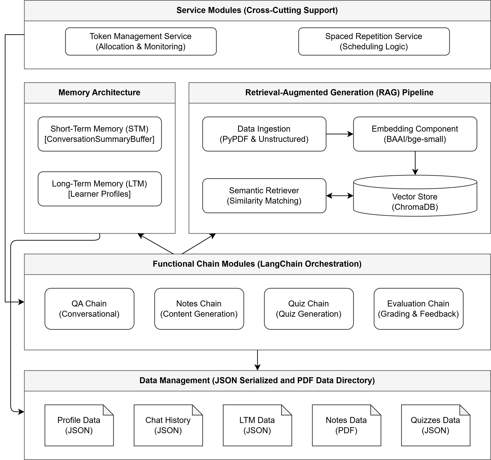

# DenseLess

> A student-centric Generative AI learning system targeting comprehension and long-term retention based on Lossan Bonde's proposed requirements, with the addition of principles derived from Cognitive Psychology research. This implementation was developed to be evaluated with the LLM-as-a-judge paradigm to see if the results are positive enough to motivate a deployment having a frontend in a real-world educational setting where real students will actually test it.

---

## 🛠 Tech Stack

| Layer | Technology |
| --- | --- |
| **Backend** | Python |
| **AI Orchestration** | LangChain (Gemini / Ollama) |
| **Database** | Chroma DB |

---

## ⚙️ Software Architecture

The architecture of Denseless is organized into four interconnected components: a core RAG pipeline, a dual-layer memory system, four functional chain modules, and two supporting service modules, all coordinated through a centralized data management component.



Upon the execution of the RAG pipeline to add the documents (knowledge sources), the learner can interact with DenseLess through one of four specific Functional Chain Modules (Notes, QA, Quiz, or Evaluation). Their request first passes through the Service Modules to authorize token usage, and then proceeds to either the Dual-Layer Memory Architecture (its STM and LTM) or the selection of appropriate prompt templates, depending on the triggered chain. Both the Memory Architecture and the prompt templates enrich the query by appending necessary context for the LLM. The Short-Term Memory (STM) maintains within-session conversational coherence by actively summarizing recent dialogue, while the Long-Term Memory (LTM) persists cross-session learning patterns. For example, the LTM might retrieve a known recurring conceptual misconception to tailor the upcoming response. The triggered chain then searches the local vector store using the enriched query to fetch relevant educational content exclusively from the learner’s uploaded materials. It utilizes specific retrieval strategies based on the task—such as exact semantic retrieval for direct questions, or broad topic retrieval for comprehensive lesson coverage.

Once the grounding context has been retrieved, the triggered Chain Module synthesizes the learner's prompt, the memory context, and the retrieved documents into a final prompt for the LLM. While all chains fetch documents from the vector store, their subsequent actions differ. For instance, the Quiz chain utilizes the retrieved context to generate a three-level assessment of 10 questions. The Evaluation chain, conversely, utilizes its retrieved context to grade the student's submission against the model answer already generated by the Quiz chain to identify specific weak areas. Finally, the generated response is delivered to the user, and all updated states—including token consumption, memory summaries, and performance profiles—are passed to the Data Management component, which persists the information as localized JSON files for future sessions.

## 🚀 Quick Start

**1. Create & activate a virtual environment**
```bash
python -m venv .venv

# Windows
.venv\Scripts\activate      

# macOS / Linux
source .venv/bin/activate   
```

**2. Install dependencies**

```bash
pip install -r requirements.txt
```

**3. Configure your environment variables**
Create a `.env` file in the root directory and add your credentials:

```env
GOOGLE_API_KEY=your_google_api_key_here
UNSTRUCT_API_KEY=your_unstruct_api_key_here
UNSTRUCT_API_URL=your_unstruct_api_url_here
```

**4. Run the AI**
To interact with the generative AI agent, open the `DEMO.ipynb` notebook.

* Execute the notebook cells sequentially, one by one.
* Make sure to modify the parameter values where explicitly instructed by the inline comments in a notebook cell.
* Following these instructions will ensure the system works exactly as intended.

## 👤 Learner Profile

All persistent data regarding a learner's progression, memory, and system usage is centralized within a local JSON file. This profile is continuously updated by the Functional Chain Modules (specifically the Evaluation chain) after user interactions.

### Root-Level Attributes

* **`user_id`**: A unique string identifier for the student (e.g., `"student_1019"`).
* **`learning_pace`**: A string (e.g., `"slow"`, `"average"`, `"fast"`) that dictates the verbosity and cognitive load of the generated instructional content.
* **`tokens_remaining`** & **`tokens_used`**: Integers tracking the user's API token consumption for governance and quota enforcement.
* **`token_history`**: An array of objects logging individual chain executions, tracking `input_tokens`, `output_tokens`, `total_tokens`, the triggered `chain`, and the `timestamp`.
* **`weak_topics`** & **`strong_topics`**: Arrays of strings categorizing overall subject areas based on aggregate quiz performance.

---

### `topics`

An object (dictionary) keyed by topic name. This section is strictly dedicated to mapping each topic to the learner's current areas of strength, weakness, and overall study progress.

**Structure:**
Each topic entry contains:

* `weak_areas`: An array of section names (matching `metadata["section"]` values from the vector store) identifying which specific sections of the topic the learner struggled with.
* `strong_areas`: An array of section names identifying which sections the learner excelled in.
* `notes_reviewed`: A boolean indicating whether the learner has completed the initial learning phase for this topic.

**Updated by:** The Evaluation chain after every quiz submission. It fully replaces the `weak_areas` and `strong_areas` arrays to reflect the learner's most current state.

**Example:**

```json
"topics": {
  "Incident Response": {
    "weak_areas": [
      "Incident response frameworks: Phases of incident response",
      "Types of security incidents",
      "Introduction"
    ],
    "strong_areas": [
      "How to create an incident response plan",
      "Why is an Incident Response Plan Important"
    ],
    "notes_reviewed": true
  }
}

```

---

### `scores`

A top-level object tracking the learner's test performance across the entire system. It categorizes all recorded scores into two global dictionaries: `comprehension` and `retention`, both of which are keyed by topic name.

#### `comprehension`

Tracks pre-study and post-study comprehension test scores. Each entry is an object within the topic's array:

* `attempt: 0` — pre-study comprehension (taken before reading the notes).
* `attempt: 1` — post-study comprehension (taken after reading the notes).

**Example:**

```json
"comprehension": {
  "Incident Response": [
    {"attempt": 0, "score": 10.0, "date": "2026-07-02"},
    {"attempt": 1, "score": 9.5, "date": "2026-07-05"}
  ]
}

```

**Updated by:** The Evaluation chain after each comprehension test submission. It appends a new entry with the next attempt index under the specific topic key.

#### `retention`

Tracks spaced repetition quiz scores taken on scheduled revision dates. Each entry follows the same structure as comprehension scores.

**Example:**

```json
"retention": {
  "Incident Response": [
    {"attempt": 0, "score": 6.0, "date": "2026-07-06"},
    {"attempt": 1, "score": 7.0, "date": "2026-07-08"}
  ]
}

```

**Updated by:** The Evaluation chain after each retention test submission. The date of `attempt: 0` serves as the anchor for the spaced repetition scheduling logic.

---

### `revision_dates`

An object mapping specific topic names to their scheduled spaced-repetition sessions. For each topic, it maintains an array of objects detailing the individual revision dates, the current completion status, and AI-generated feedback.

**Structure:**
The values are arrays where each object contains:

* `date`: An ISO date string representing when the revision quiz is scheduled to be taken.
* `status`: A string indicating the current state of the session (`"pending"` or `"completed"`).
* `feedback`: A string containing personalized, high-level feedback generated by the Evaluation chain based on the learner's performance during that specific day's quiz. Initialized as `null`.

**Spacing pattern from anchor date:**

* +1 day
* +3 days
* +1 week
* +2 weeks

**Generation & Update Triggers:**

* **Generation:** When `scores.retention` receives its first entry (`attempt: 0`) for a given topic, the system anchors to the current date. It generates the scheduled dates for that specific topic and writes them to the profile with `status` set to "pending" and `feedback` set to `null`.
* **Update:** After the learner completes a scheduled revision quiz for a topic, the Evaluation chain assesses the score and weak/strong areas, updates the `status` to "completed", generates a concise feedback string, and updates the `feedback` key for that specific date's object.

**Example:**

```json
"revision_dates": {
  "Incident Response": [
    {
      "date": "2026-07-06",
      "status": "completed",
      "feedback": "Your overall score of 6 out of 10 suggests that while you have a basic understanding..."
    },
    {
      "date": "2026-07-19",
      "status": "pending",
      "feedback": null
    }
  ]
}

```

## 📂 Project Structure

```text
DenseLess/
├── app/
│   ├── agent/         
│   │   ├── dataset/         
│   │   ├── rag/         
│   │   │   ├── chains/          
│   │   │   │   ├── eval_chain.py          
│   │   │   │   ├── notes_chain.py          
│   │   │   │   ├── qa_chain.py          
│   │   │   │   └── quiz_chain.py          
│   │   │   ├── eval_data/        # Output data of eval notebooks         
│   │   │   ├── ingestion/          
│   │   │   ├── retrieval/          
│   │   │   └── prompts.py          
│   │   ├── DEMO.ipynb            # For testing GenAI agent functionality
│   │   └── testing.ipynb         # Sample test by developers
│   ├── chroma_db/         
│   ├── pdfs/                     # User's PDF materials 
│   └── services/           
│       ├── quiz_router/           
│       └── token_service/           
├── data/                         # App's data storage 
│   ├── chat_history/           
│   ├── ltm/           
│   ├── notes/           
│   ├── profiles/           
│   └── quizzes/           
├── .env                          # Environment variables (not committed)
├── rag_pipeline.ipynb            # Sample notebook for the RAG pipeline
├── README.md
└── requirements.txt

```

## 📂 Data management
All data is stored in the `data/` directory, which is organized into subdirectories for different types of data:

- `chat_history/`: Stores conversation histories.
- `ltm/`: Stores long-term memory data about the user based on interactions based on their user_id.
- `notes/`: Stores AI generated notes by the user.
- `profiles/`: Stores user's learner profile data.
- `quizzes/`: Stores each quiz's data which for each includes 10 questions of the form; level, question, model_answer, student_answer, score, explanation, source_pages, and section.